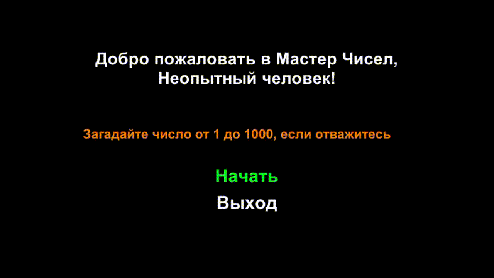

# NumberWizardМастер чисел

**Number Wizard** - это простая текстовая игра, в которой вам нужно придумать число от 1 до 1000, а компьютер попытается угадать за ограниченное количество попыток. Игра имеет минималистичный интерфейс с текстовым выводом.

## **Особенности**
### **Угадывание числа**
Компьютер будет делать интеллектуальные догадки на основе вашей обратной связи. Он начинает с первоначального угадывания и корректирует свои последующие угадывания в зависимости от того, больше или меньше фактическое число.
### **Ввод данных пользователем**
Вы можете дать обратную связь для угадывания компьютером, используя три кнопки: "Ниже", если фактическое число ниже угаданного, "Выше", если оно выше, и "Да", если компьютер угадал правильное число.
### **Четыре сцены**
Игра состоит из четырех сцен: Меню, Победа, Поражение и основная сцена игры. Каждая сцена обеспечивает различный контекст и пользовательский опыт.
### **Цель игры**
Проверить, сможет ли компьютер точно угадать ваше число в течение заданного количества попыток. Сможете ли вы перехитрить Мастера чисел и сохранить свой номер в тайне?

### **Используемые технологии и языки:**
**Язык:** C#  
**Framework:** Unity  
**IDE:** Visual Studio

## **Установка и использование**
1) Клонируйте репозиторий на локальную машину.
2) Откройте проект в Unity или предпочитаемой IDE, совместимой с Unity.
3) Соберите и запустите игру.
4) Следуйте инструкциям на экране, чтобы играть в игру.
5) Используйте кнопки "Ниже", "Выше" и "Да", чтобы направлять догадки компьютера и обеспечивать обратную связь.

***Наслаждайтесь игрой "Мастер чисел" и проверьте свою способность сохранить секретное число, скрытое от догадливого компьютера!***

